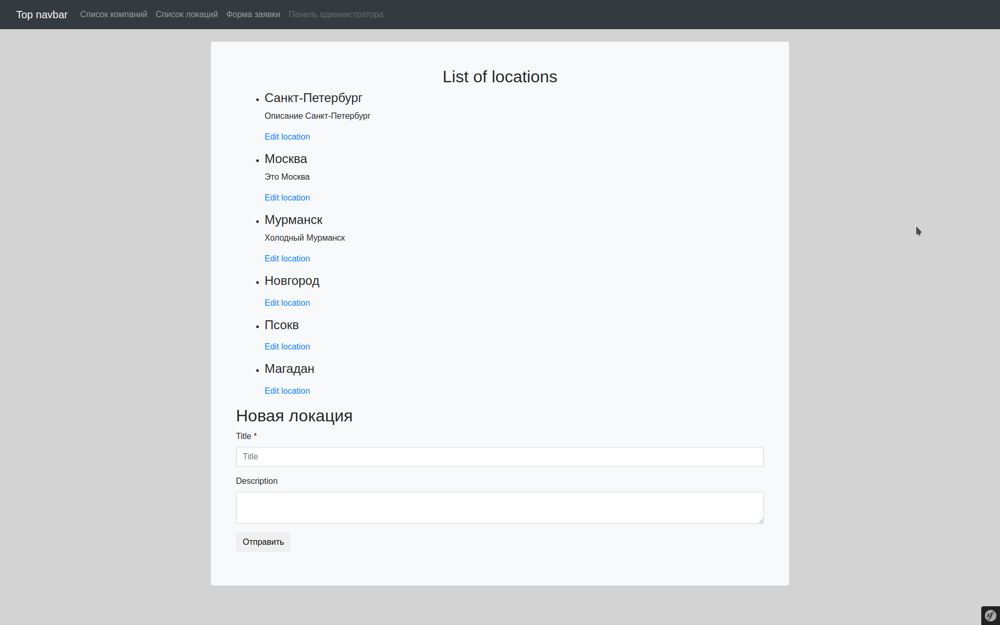

## Installation

### Clone repository and run docker
1. git clone https://github.com/varahi/test-logis.git
2. cd directory "test-logis/docker" and run ./docker-compose.sh
   Phpmyadmin http://127.0.0.1:8765/ login: root pass: dev

### Build project
1. cd directory "src" and run composer update
2. yarn install
3. yarn add @babel/preset-react --dev
4. yarn add react-router-dom@5.2.0
5. yarn add --dev react react-dom prop-types axios
6. yarn add @babel/plugin-proposal-class-properties @babel/plugin-transform-runtime
7. yarn build

### Import database
cat database.sql | docker exec -i test_project_mysql /usr/bin/mysql -u root --password=dev symfony_dev

### Описание проекта
1. Сущность Company
title  
description  
delivery - > OneToMany -> Delivery (like tour)  
orders -> OneToMany -> Order  

---

2. Сущность Delivery
title  
isFastDelivery (на данный момент это свойство отстсвует)  
weight  
departure - > ManyToMany -> Location  
destination - > ManyToMany -> Location  
fromDate  
toDate  
company -> ManyToOne

---

3. Сущность Order
title  
createdAt  
company -> ManyToOne -> Company  
delivery -> ManyToOne -> Delivery  

---

4. Сущность Location
title  
description  
deliveries - > OneToMany -> Delivery  

Для наглядного представления модели реализована админ панель http://127.0.0.1/admin  
Список компаний и список локаций рендерятся посредством React.js получая соответсвующие JSON 
http://127.0.0.1/api/companies
http://127.0.0.1/api/locations  
Формы добавления и редактирования реализованы стандартными средствами Symfony  

